# Mint Classics Inventory Analysis: Data-Driven Warehouse Optimization

## Project Overview
Mint Classics is a fictional retailer of classic model cars and collectible vehicles. The company is evaluating the potential closure of one of its storage warehouses to reduce operational overhead and improve inventory efficiency.

This project involves conducting exploratory data analysis using MySQL Workbench on a relational database containing business-critical data such as inventory levels, sales records, employee assignments, and product information. The goal is to assess warehouse performance using key metrics like turnover rate, overstock ratio, inventory utilization, and revenue contribution to inform a data-driven recommendation on which warehouse should be considered for closure.

#### 🌐  Link to Coursera project: [Mint Classic Coursera Project](https://www.coursera.org/learn/showcase-analyze-data-model-car-database-mysql-workbench/home/welcome)
---
## Objectives

1. Explore products currently in inventory.
2. Determine important factors that may influence inventory reorganization/reduction.
3. Provide analytic insights and data-driven recommendations.
   
Guided by the objectives, SQL queries were developed and executed in MySQL Workbench to analyze the relational database and answer key questions, such as:

- Which warehouse is most/least efficient?
- Where are we overstocking vs. under-selling products?
- Can inventory be redistributed to avoid service disruptions?
- What is the revenue and operational performance of each warehouse?
___

## Data Model & Schema Overview
This project utilizes a structured relational database which included several interconeected tables:

`products` and `productLine` – Information on each model car, including quantity in stock, warehouse location, MSRP, and buy price.

`orders` and `orderdetails` – Sales transaction data, including order quantities, prices, and product references.

`employees` and `offices` – Organizational data linking staff to geographic regions.

`customers` – Customer and account details, linked to employees for sales tracking.

The relationships between these tables are illustrated in the EER (Enhanced Entity-Relationship) diagram below:
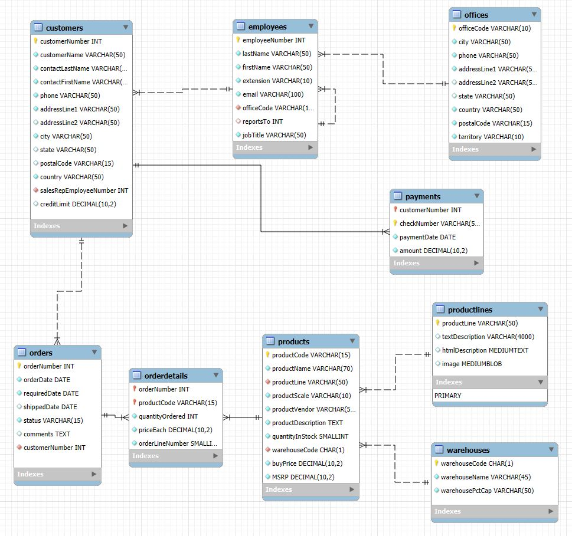
___
## Data Analysis and Key Insights
This section outlines the processes taken the analyze and to determine which Mint Classics warehouse may be closed with minimal disruption and maximum efficiency. Each subsection presents a key business question, a brieft description of the analysis performed with MySQL Workbench, and insights gathered.

## 1.) Which Warehouse Generates the Most Revenue? What are the total sales figures by warehouse?

### Analysis:
To obtain the `total_revenue` per warehouse, `priceEach` and `quantityOrdered` from table `orderdetails` were multiplied. `join`, `ORDER BY` and `GROUP BY`clause were utilized in order to obtain the results per warehouse.

<details>
<summary>Click to expand SQL Query</summary>
  
 ```sql
 SELECT p.warehouseCode, 
       SUM(od.quantityOrdered * od.priceEach) AS total_revenue
FROM orders o
JOIN orderdetails od ON od.orderNumber = o.orderNumber
JOIN products p ON od.productCode = p.productCode
GROUP BY p.warehouseCode;--
```
 </details> 

## Key Findings:

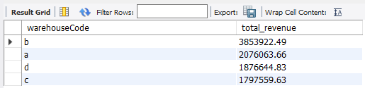

• Warehouse B generated approximately #3.8 million dollars, having the most total sales compare to other warehouses.

• Warehouse C had the lowest total revenue at $1.7 million dollars, suggesting inefficiencies in inventory usage despite comparable stock levels.

<p align="center">  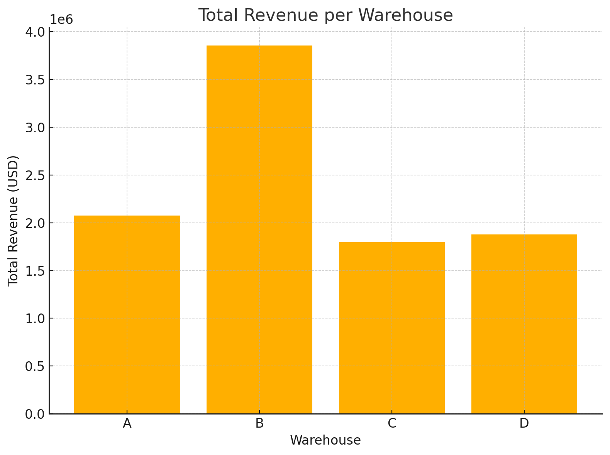 </p>

### Revenue Trends Over Time
A 2nd SQL query was written to track revenue changes over time. This reveals seasonal or operational trends across warehouses.

<details> <summary> Click to expand SQL Query</summary>
  
```sql

SELECT DATE_FORMAT(o.orderDate, '%Y-%m') AS 'year-month', p.warehouseCode,
       SUM(od.quantityOrdered * od.priceEach) AS total_revenue
FROM orders o
JOIN orderdetails od ON od.orderNumber = o.orderNumber
JOIN products p ON od.productCode = p.productCode
GROUP BY p.warehouseCode, DATE_FORMAT(o.orderDate, '%Y-%m')
ORDER BY 'year-month';
```
</details>


### Insights:

 <p align="center"> 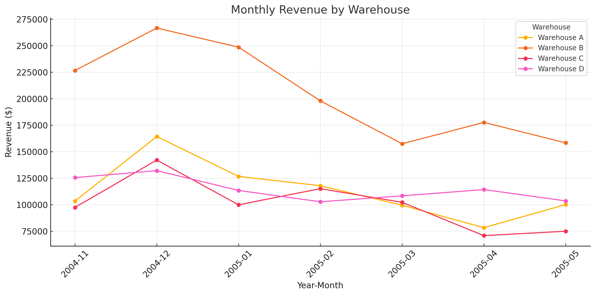 </p>


• Warehouse A revenue seems to be at a **decline** since April 2005, by May at revenue of $78,479.32.

• Warehouse B revenue steadied since Christmas of 2004, then at a revenue of $177,674.87 by May 2005.

• Warehouse C revenue steadied since Christmas 2004, then at a revenue of $70,964.85 by May 2005.

• Warehouse D revenue hit a bottom of $6034.22 at the end of April 2005, but at an **increase** to $114,355.90 by May 20005
___

## 2.) Which Warehouse Has the Slowest-Moving Inventory? What is the turnover rate (units sold ÷ units in stock) for each warehouse?

## Analysis:
In Mintclassics database, the table `warehouse` demonstrated warehouse capacity percentage.

</details> <p align="center"> 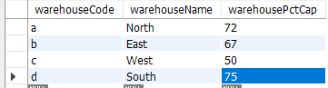 </p>


This suggested that:

•Warehouse C (West) is operating at only **50%** capacity, the lowest among all.

•Warehouse D (South) is operating near full at **75%**, indicating high utilization.

To assess how efficiently warehouses are moving their inventory, we computed the **inventory turnover rate**, which compares total units sold to total inventory stocked. The SQL query summed `quantityOrdered` and q`uantityInStock` per warehouse, and calculated:

$Turnover\ Rate = \frac{Total\ Units\ Sold}{Total\ Inventory}$

This allowed us to identify slow-moving inventory, where stock remains unsold for longer durations.

<details><summary> Click to expand SQL Query</summary>
  
```sql

SELECT 
    p.warehouseCode, 
    SUM(od.quantityOrdered) AS total_units_sold,
    SUM(od.quantityOrdered) / SUM(p.quantityInStock) AS turnover_rate
FROM products p
JOIN orderdetails od ON p.productCode = od.productCode
GROUP BY p.warehouseCode
ORDER BY turnover_rate ASC;
```
</details>

## Key Findings:


</details> <p align="center"> 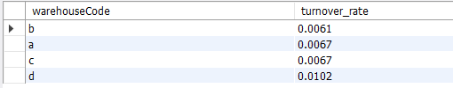 </p>
• Warehouse B had the lowest turnover rate, indicating a stockpile of slow-moving goods.

• Warehouse D had the highest turnover, suggesting more efficient inventory movement.

## 3.) Which Products Are Overstocked Compared to Sales? Are there products with excessive inventory compared to their sales?

### Analysis:
To identify products where the quantity in stock far exceeds their actual sales and demand, we define an overstocked product as:

$Overstock \ Ratio = \frac{quantityinStock}{quantityOrdered}$
With this, the average overstock ratios per warehouse were calculated to identify underperforming warehouse. Then each product can be associated with the overstock ratio to find the performance of the products. By using `COUNT(*)`and `HAVING` clauses in SQL, products with an overstock ratio of >100 are considered significantly overstocked. These underperforming products may warrant further evaluation for potential markdowns, redistribution, or removal from the product line to improve overall inventory efficiency.

<details><summary> Click to expand SQL Query</summary>
  
```sql
---Overstock Ratio per warehouse
SELECT 
    p.warehouseCode, 
    SUM(od.quantityOrdered) AS total_units_sold,
    SUM(od.quantityOrdered) / SUM(p.quantityInStock) AS turnover_rate
FROM products p
JOIN orderdetails od ON p.productCode = od.productCode
GROUP BY p.warehouseCode
ORDER BY turnover_rate ASC;

--- number of overstock_products per warehouse, 71 distinct products
SELECT warehouseCode, COUNT(*) AS num_overstocked_products
FROM (
    SELECT p.productCode, p.warehouseCode,
           SUM(p.quantityInStock) AS total_inventory,
           SUM(od.quantityOrdered) AS total_sales
    FROM products p
    JOIN orderdetails od ON p.productCode = od.productCode
    GROUP BY p.productCode, p.warehouseCode
    HAVING SUM(p.quantityInStock) / SUM(od.quantityOrdered) > 100
) AS overstocked_products
GROUP BY warehouseCode;

```
</details>

##  Key Findings:
</details> <p align="center"> 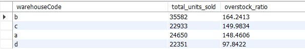 </p>

</details> <p align="center"> 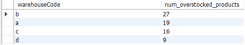 </p>

• A total of *71* distinct products are identified as overstocked.  
• A majority were found in **Warehouse B**, reinforcing inefficiency in stock management for the warehouse.
___
## 4.) What Is the Value of Overstocked Inventory?

### Analysis:
The total inventory value of products with an overstock ratio > 100 were calculated to quantify the financial impact of slow moving inventory. Summed values for per warehouse were calculated for only products with an overstock ratio of > 100.

<details><summary> Click to expand SQL Query</summary>
  
```sql
SELECT 
    final.warehouseCode,
    SUM(final.overstocked_inventory_value) AS total_overstocked_value
FROM (
    SELECT 
        p.warehouseCode,
        (p.quantityInStock * p.buyPrice) AS overstocked_inventory_value
    FROM products p
    LEFT JOIN orderdetails od ON p.productCode = od.productCode
    GROUP BY p.productCode, p.warehouseCode, p.quantityInStock, p.buyPrice
    HAVING (SUM(p.quantityInStock) / SUM(od.quantityOrdered)) > 100
) AS final
GROUP BY final.warehouseCode
ORDER BY total_overstocked_value DESC;
```
</details>

## Key Findings:

</details> <p align="center"> 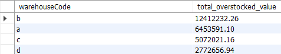 </p>

- Warehouse B has the highest dollar value of its idle inventory at $1,241,232, significantly higher than any other warehouse.

- Warehouse D has the least overstocked products valued at $277,266, suggesting more efficient inventory and sales levels.

- Warehouse B not only has the largest inventory, but it also ties up most capital in slower turnover or excess stocks of products.
___

## 5.) Which Products Have the Highest Overstock Ratios?

### Analysis:
Following sql query analysis similar to previous question, the overstock ratio was calculated for each product, then clauses like `GROUP BY` or `HAVING` were utlized to identity the Top 10 products with the higheset overstock ratios.

<details><summary> Click to expand SQL Query</summary>
  
```sql
SELECT
    p.productCode, p.productName, p.warehouseCode, p.productLine,
    SUM(p.quantityInStock) / SUM(od.quantityOrdered) AS overstock_ratio
FROM products p
JOIN orderdetails od ON p.productCode = od.productCode
GROUP BY p.productCode, p.productName, p.warehouseCode
HAVING SUM(p.quantityInStock) / SUM(od.quantityOrdered) > 100;
```
</details>

## Key Findings:

</details> <p align="center"> 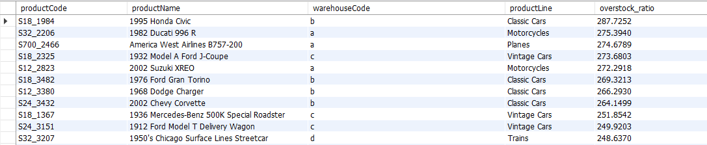 </p>

- Top 10 most overstocked products are spread across Warehouses B, C and A, with 1995 Honda Civic as the most overstocked product in Warehouse B.
- Several products show overstock ratios > 200, meaning stock levels are twice or more higher than what sales would justify.
____

## 6.) Which Products Are in the Bottom 10% of Sales Performance?

### Analysis:
To evaluate product-level performance, SQL window functions were used to segment all products into sales percentiles based on total units sold.

`NTILE(10)` divided the product list into ten equally sized groups.
Products falling into the 10th percentile (lowest 10%) were flagged as the worst-selling products.`JOIN` and `GROUP BY` clauses were used to aggregate sales by product.


<details><summary> Click to expand SQL Query</summary>
  
```sql
 SELECT
        p.productCode,
        p.productName,
        p.warehouseCode,
        SUM(od.quantityOrdered) AS total_units_sold,
        NTILE(10) OVER (ORDER BY SUM(od.quantityOrdered) DESC) AS sales_percentile
    FROM products p
    JOIN orderdetails od ON p.productCode = od.productCode
    GROUP BY p.productCode, p.productName, p.warehouseCode
    ORDER BY total_units_sold DESC;
```
</details>

## Key Findings:

<p align="center"> 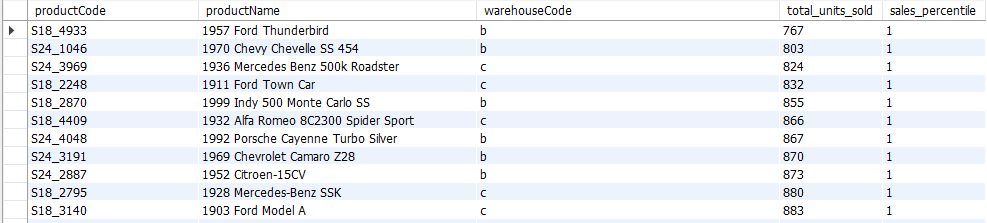 </p>

- Warehouse B has the highest concentration of bottom 10% selling products. Reinforces earlier findings that warehouse B houses a large amount of underperforming inventory. 

- Many of these products have total sales below 900 units across the data period.

- Some of these slow-moving products are strong candidates for discontinuation or redistribution to optimize space and reduce overhead.
___

## Conclusion: 
After an extensive SQL-based analysis, Warehouse B (East) has emerged as the most strategic candidate for closure. This recommendation is grounded in multiple key performance metrics:

 - Highest total revenue at ~$3.8M — but misleading due to poor efficiency.

- Lowest turnover rate among all warehouses — indicating a large stock of unsold products.

- Most overstocked products — with 71 items significantly exceeding demand levels.

- Over $1.24M in idle inventory value — the highest across all locations.

- High concentration of bottom 10% sellers — suggesting long-term inefficiency and product stagnation.

While Warehouse B appears profitable at first glance due to high revenue, deeper analysis reveals it is the least operationally efficient, holding the largest volume of slow-moving, overstocked, and underperforming inventory. It also ties up substantial capital in low-demand items as well as having poor inventory utilization relative to capacity.

Closing Warehouse B would free up resources, reduce carrying costs, and enable better inventory reallocation to more efficient warehouses like D (South) or A (North) — both of which exhibit better turnover and utilization rates.

This recommendation is a product of real SQL-driven decision-making — translating raw warehouse and sales data into tangible business actions. It showcases how data science can guide strategic logistics planning and cost optimization in retail operations. However, additonal and deeper analysis such as simulating the relocation of inventory from B to C or D, liquidation modeling, or relational insights between employees, customers, their orders and its pattern can be conducted to bring more accurate and confident solutions for the business. 
___
___


<!-- ## 🎓 Author
**Clem117343** | Aspiring AI Engineer with a passion for SQL, data, and operational insights. -->


## 🌍 Connect
- [LinkedIn Profile](https://www.linkedin.com/in/clementchai117)
- [Portfolio Website](https://yourwebsite.com) _(optional)_

> “In God we trust. All others must bring data.” — W. Edwards Deming

